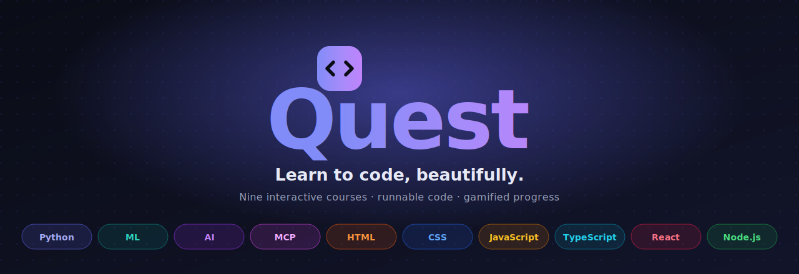

<div align="center">



<h1>Quest</h1>

**The beautiful, gamified way to learn to code — from your first `print()` to neural networks and full-stack web.**

Nine interactive courses. Runnable code in the browser. XP, streaks, badges, and animated visualizers that show what's happening under the hood.


</div>

---

## What is Quest?

Quest is a self-contained, static learning platform for programming. Pick a path — **AI & Python** or **Web Development** — and work through gorgeous, interactive lessons where you can *actually run the code you're reading*, take auto-graded challenges, and watch algorithms animate step by step. Every completed lesson earns XP, feeds your streak, and unlocks badges. It runs entirely in the browser: no accounts, no backend, works offline once loaded.

Think of it as the lovechild of an interactive textbook, a live playground, and a video game — for **Python, Machine Learning, AI, Large Language Models, the Model Context Protocol, HTML, CSS, JavaScript, TypeScript, React, and Node.js**.

## The courses

| # | Course | Lessons | Runs in-browser | Extras |
|---|--------|:-------:|-----------------|--------|
| 🐍 | **Python** | 66 | ✅ real Python (Pyodide) | full OOP · slide decks · capstone projects · certificate |
| 📊 | **Machine Learning** | 13 | ✅ real Python | 8 animated algorithm visualizers |
| 🤖 | **Artificial Intelligence** | 14 | ✅ real Python | 4 animated search / game / net visualizers |
| 🧠 | **Large Language Models** | 12 | interactive visualizers | tokens, embeddings, attention, sampling & more |
| 🔌 | **Model Context Protocol** | 10 | reference examples | build a real agent connector in Node & Python |
| 🧱 | **HTML** | 8 | ✅ live page preview | semantic & accessible markup |
| 🎨 | **CSS** | 9 | ✅ live style preview | box model · Flexbox · Grid · animations |
| ⚡ | **JavaScript** | 23 | ✅ live console | closures, OOP, the event loop & a TypeScript primer |
| 🔷 | **TypeScript** | 7 | ✅ compiles & runs | types · generics · narrowing |
| ⚛️ | **React** | 12 | ✅ live component preview | JSX · state · hooks · context · forms |
| 🟢 | **Node.js** | 11 | reference examples | the event loop · streams · events · Express · REST |

> **185 lessons · 726 auto-graded challenges · 63 interactive slide decks · 42 animated visualizers.**

## Features

### ▶︎ Run code where you read it
- **Python, ML & AI** execute *real* Python in your browser via [Pyodide](https://pyodide.org/) (CPython compiled to WebAssembly) — edit any example, hit **Run**, see the exact output, with friendly plain-English error explanations.
- **Web courses** run in a secure sandboxed `<iframe>`: **HTML** renders a live page, **CSS** applies to an auto-generated demo layout built from your own selectors, **JS/TS** stream `console.log` output (TypeScript is transpiled on the fly), and **React** mounts your component as a live, clickable preview.

### 🎮 Gamified from the ground up
XP for every lesson, quiz, challenge, and code run · levels with playful ranks · daily streaks · unlockable badges · confetti on wins · a completion certificate for finishing Python.

### 🧠 Learn by doing
- **Interactive slide decks** walk through each idea before the deep dive.
- **Auto-graded challenges** in four flavours — *predict the output*, *fix the bug*, *fill in the blank*, and *reorder the lines* — with teaching explanations.
- **Animated visualizers** show gradient descent, k-means, decision trees, A\* search, minimax, perceptrons and more, *moving* — not as static diagrams.
- **Capstone projects** and hands-on exercises with hints and full solutions.

### ✨ Crafted experience
Command palette + full-text search (`⌘K`) · keyboard navigation · on-page table of contents · reading-progress bar · custom SVG icon set · per-course accent theming · polished light & dark modes (respects `prefers-reduced-motion`) · every page pre-rendered and static.

## Quick start

```bash
git clone <your-repo-url> quest
cd quest
npm install
npm run dev
```

Open **http://localhost:3000**. That's it — no environment variables, no database, no services.

### Scripts

| Command | What it does |
|---------|--------------|
| `npm run dev` | Regenerates content, then starts the dev server on `:3000` |
| `npm run build` | Regenerates content, then builds the static production app |
| `npm run start` | Serves the production build |
| `npm run gen` | Rebuilds the content maps from JSON (auto-run before dev/build) |
| `npm run lint` | Lints with `next lint` |
| `npx tsc --noEmit` | Type-checks the project |

## How it works

Quest is **content-as-data**. Each lesson is a JSON file; a build step compiles those into static TypeScript maps that one course-agnostic component set renders.

```
lib/<course>/lessons/<slug>.json      ── the lesson (blocks, exercise, takeaways)
lib/<course>/slides/<slug>.json       ── optional interactive walkthrough
lib/<course>/challenges/<slug>.json   ── optional auto-graded challenges
        │
        ▼   scripts/build-lessons.mjs  (runs on predev / prebuild)
lib/<course>/generated-*.ts           ── static import maps
        │
        ▼   lib/course-factory.ts  →  lib/courses.ts (the 9-course registry)
        ▼
components/LessonRenderer.tsx  ── dispatches by runtime:
   • runtime "python"  → PyRunner   (Pyodide)
   • runtime "web"     → WebSandbox (sandboxed iframe; Node stays read-only)
```

The content layer normalizes everything defensively, so a missing or malformed lesson degrades to a placeholder instead of breaking the app. Adding a lesson or a whole course is mostly authoring JSON — see **[CONTRIBUTING.md](CONTRIBUTING.md)** for the step-by-step, and **[CLAUDE.md](CLAUDE.md)** for the deep architecture reference.

## Tech stack

- **[Next.js 14](https://nextjs.org/)** (App Router) + **TypeScript** (strict), fully static output
- **[Tailwind CSS](https://tailwindcss.com/)** with a CSS-variable design-token system (per-course accents, light/dark)
- **[Framer Motion](https://www.framer.com/motion/)** for animation · **[next-themes](https://github.com/pacocoursey/next-themes)** for theming
- **[Pyodide](https://pyodide.org/)** (in-browser Python) — loaded lazily on first run
- Custom, dependency-free **syntax highlighter** and **SVG icon set** — no heavy libraries

## Project structure

```
app/            routes: splash, /tracks/[track], /learn (Python), /ml, /ai, /[course] (web)
components/     LessonRenderer, PyRunner, WebSandbox, Challenges, Slides, visualizers, shell/UI
lib/            courses registry, course factory, per-course content + generated maps,
                highlighters, Pyodide + WebSandbox runtimes, gamification, search
scripts/        build-lessons.mjs — JSON → generated TS maps
```

## Roadmap

Ideas on deck (contributions welcome):

- [ ] Make progress, badges & the certificate **course-aware** (per-course completion + credentials)
- [ ] Split lesson metadata from bodies + lazy-load runtimes to trim first-load JS
- [ ] Slide decks & more challenges for the ML/AI and web courses
- [ ] A shared web playground and per-course projects
- [ ] Accessibility pass (focus traps, live regions, visualizer text alternatives)

## Contributing

PRs and ideas are welcome — new lessons, challenges, visualizers, fixes, or polish. Start with **[CONTRIBUTING.md](CONTRIBUTING.md)**, and please follow the **[Code of Conduct](CODE_OF_CONDUCT.md)**.

## License

No license has been chosen yet, so all rights are reserved by default. If you'd like to reuse this code, please open an issue to ask.

<div align="center">
<sub>Built with Next.js, a lot of care, and a little confetti. 🎉</sub>
</div>
